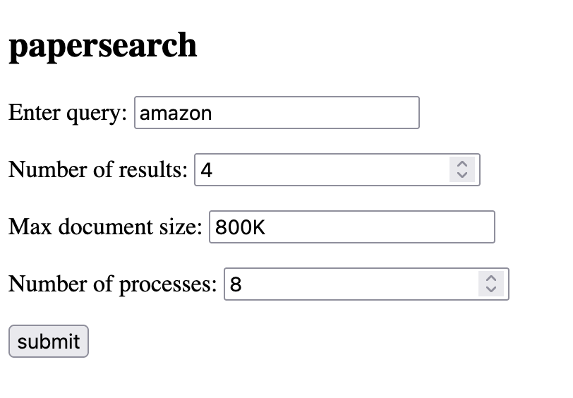

# papersearch
[tf-idf](https://en.wikipedia.org/wiki/Tf%E2%80%93idf) search engine for papers-we-love

## Setup
```
$ git clone git@github.com:jamesma100/papersearch.git
$ cd papersearch
$ git clone git@github.com:papers-we-love/papers-we-love.git
```

## Usage
From the command line:
```
$ python3 indexer.py [-h] [-s MAX_SIZE] [-r MAX_RESULTS] [-p PROCESS_CNT] prompt [prompt ...]
```

For example run:
```
$ python3 indexer.py -s 1.5M -r 10 -p 8 map reduce
```
to run the indexer for words "map" and "reduce", limit to <1.5 MB documents, show the top 10 results, and start 8 processes. In general, the more processes you start the faster your search will be since the documents are indexed in parallel (up to the number of cores your machine has).

If all goes well you should get:
```
$ python3 indexer.py -s 1.5M -r 10 -p 8 map reduce
INFO: skipping documents over: 1572864.0 bytes
INFO: received prompt: ['map', 'reduce']
INFO: number of processes to start: 8
INFO: parsing documents...
INFO: number of documents indexed: 184
INFO: building global index...
INFO: calculating tf-idf for index...
RESULT: top 10 results for prompt: map reduce
1. mapreduce-simplified-data-processing-on-large-clusters.pdf: 0.0099
2. rados-a-scalable-reliable-storage-service-for-petabyte-scale-storage-clusters.pdf: 0.0082
3. why-functional-programming-matters.pdf: 0.0054
4. ideal-hash-trees.pdf: 0.0043
5. spartan-a-distributed-array-framework-with-smart-tiling.pdf: 0.0036
6. a-constant-algorithm-for-implementing-the-lfu-cache-eviction-scheme.pdf: 0.0021
7. frp-in-plt-scheme.pdf: 0.002
8. a-practical-optional-type-system-for-clojure.pdf: 0.002
9. graph_of_word_and_tw_idf.pdf: 0.0019
10. network-challenges-of-data-recovery-in-erasure-coded-distributed-storage-systems.pdf: 0.0019
```
These are the top 10 documents matching your search query, along with their tf-idf scores.

You can also start a local web server and interact with the search engine from your browser. Run:

```
$ python3 server.py
```
then go to `http://127.0.0.1:5000` from your browser.



